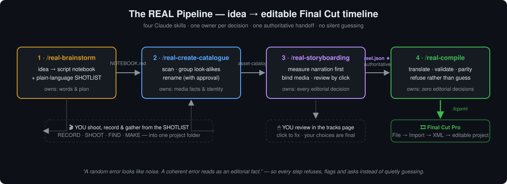
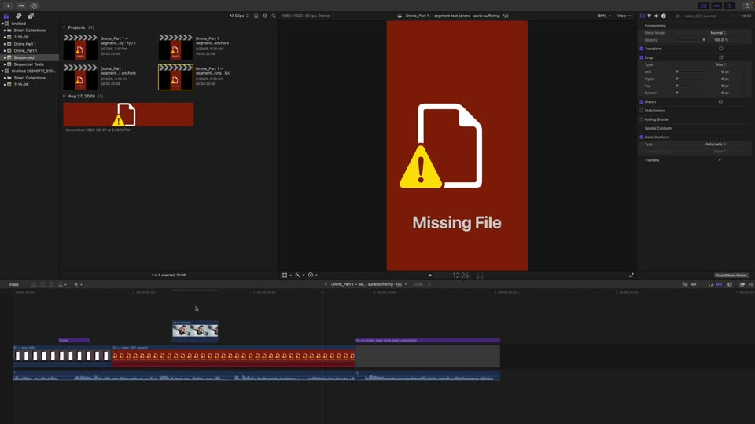
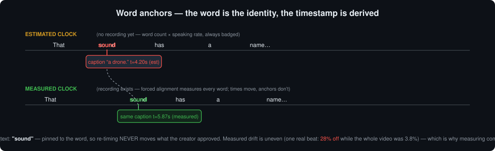

<h1 align="center">🎬 REAL Pipeline</h1>

<p align="center"><b>A vision for AI-assisted video editing — and a running journal testing whether it's reachable, one capability at a time.</b></p>

<p align="center">
  
  
  
  
  
</p>

<p align="center"></p>

---

## 💡 The two layers of this project

**Layer 1 — the vision.** Most AI video tools generate video. We think the more useful
thing is an AI agent acting as a **production crew for a human director** — planning,
cataloguing, storyboarding and compiling the director's *own* script and footage into a
real, editable Final Cut Pro project. The human makes every creative call; the agent does
the bookkeeping and **refuses to guess**. This repo contains two full iterations of that
vision: [batch 1](skills/batch-1/), built and field-tested against real productions, and
[batch 2](skills/batch-2/), rebuilt from everything batch 1 taught us. The vision is our
North Star — it's stated, illustrated, and installable today.

**Layer 2 — the journal.** A vision is a claim about *potential*. We're a two-person
student team, so rather than pretending we can field a production tool full-time, the
ongoing work is to **test the potential directly**: one capability, one measurement, one
demo video, one journal entry at a time. Capabilities that hold up get folded back into
the next revision of the skills.

📓 **[Read the Capability Journal →](journal/)** — the ongoing track. Entry 001: can
media placements land on the exact spoken word?

The finding that started it all, from batch 1's field sessions:

> **"A random error looks like noise. A coherent error reads as an editorial fact."**
>
> Agent pipelines fail *dangerously* when they fail coherently — a stage direction
> silently counted as narration doesn't look like a bug, it looks like pacing. Every
> design decision here follows from that observation.

📄 **[Read the Workflow Gap Report →](skills/batch-1/GAP-REPORT.md)** — what broke in
iteration 1, why each break was dangerous, and what we measured (perceptual-hash distance
bands, token-per-MB transport costs, 28%-on-one-beat clock drift, silent-drop translation
bugs, and more).

## 🎥 See it work

| | |
|---|---|
| <a href="https://www.youtube.com/watch?v=Oz6rBUQU4j8"></a> | **Word-anchor precision demo** (2:38) — screen recording of the pipeline's output imported into Final Cut Pro, with on-screen elements landing on the exact spoken word. <br/>▶ [Watch on YouTube](https://www.youtube.com/watch?v=Oz6rBUQU4j8) · [journal entry 001](journal/001-word-anchor-snapping/) · [what the red clip means](skills/batch-1/outputs/README.md) |
| 🖱 | **[Open the live interactive storyboard →](https://this-goober.github.io/REAL/skills/batch-1/outputs/STORYBOARD-segment.html)** — a real review page from a batch-1 session: embedded thumbnails, per-scene layers, candidate alternatives, click-to-correct. |

## ⚙️ How the vision works

The director stays in creative control at two points (the shotlist and the storyboard review); the agent owns everything mechanical. **One owner per decision, one authoritative handoff** (`reel.json`), and every step validates rather than trusts:

| Step | Skill | You bring | You get | It owns |
|---|---|---|---|---|
| 1 | `/real-brainstorm` | an idea, or your script | `NOTEBOOK.md` + plain-language `SHOTLIST.md` (RECORD / SHOOT / FIND / MAKE) | words & plan |
| 2 | `/real-create-catalogue` | your footage folder | clean filenames (with your approval), illustrated catalogue, `asset-catalog.json` | media facts & identity |
| 3 | `/real-storyboarding` | notebook + catalogue | interactive tracks page + **`reel.json`** (the authoritative edit) | every editorial decision |
| 4 | `/real-compile` | `reel.json` | validated `.fcpxml` → **File → Import → XML** in Final Cut | zero editorial decisions |

The timing core — the finding that shaped the whole architecture:

<p align="center"></p>

Full ownership table: [**responsibility matrix**](skills/batch-2/skills/real-storyboarding/references/responsibility-matrix.md) · Full walkthrough: [**user manual**](skills/batch-2/REAL-PIPELINE-MANUAL.md)

## 🚀 Quickstart

**Prereqs:** a [Claude](https://claude.ai) account (skills work in Claude apps / Claude Code) · macOS with Final Cut Pro for the final import · `python3` + `ffmpeg` if you want to run the verification suite.

### A. Run the pipeline on your own reel

```bash
git clone https://github.com/This-Goober/REAL.git
cd REAL/skills/batch-2/skills
# package each skill for upload (Claude → Settings → Capabilities → Skills):
for s in real-*; do zip -r "$s.skill" "$s"; done
```

Then follow the **[step-by-step user manual](skills/batch-2/REAL-PIPELINE-MANUAL.md)** — it tells you what to bring to each step, what happens, and what you get out. The short version:

1. Put everything in **one folder on the Mac that runs Final Cut**, and start sessions there.
2. `/real-brainstorm` your idea → go shoot the SHOTLIST (record narration early — measured beats estimated).
3. `/real-create-catalogue` the folder → approve the rename list, answer the "same setup or different?" questions.
4. `/real-storyboarding` → review by *clicking* in the tracks page until it's right.
5. `/real-compile` → import the `.fcpxml` → finish like any Final Cut project.

### B. Reproduce our verification (no footage needed)

The regression suite builds a synthetic project — generated test video, near-duplicate images, a real notebook — and drives every script end-to-end, pinning all 16 findings-derived checks:

```bash
cd REAL/skills/batch-2/skills
pip install pillow            # ffmpeg also required (brew install ffmpeg / winget install ffmpeg)
python3 real-storyboarding/tests/regression.py
# expected: ALL 21 CHECKS PASS (spec items covered: [1..16])
```

## 🧭 Current state & limitations

Honesty is the point of this repo, so, plainly:

| Area | State |
|---|---|
| **The vision** (the four-step workflow) | ✅ Stated & illustrated across two full iterations; installable today |
| **Batch 1 findings** ([gap report](skills/batch-1/GAP-REPORT.md)) | ✅ **Field-verified** on real productions — the trustworthy core of this repo |
| Batch 2 architecture (the four `/real` skills) | ✅ Implemented; every finding maps to a code change |
| Batch 2 regression suite | ✅ 21/21 green (synthetic end-to-end) |
| **Capability journal** ([journal/](journal/)) | 🔄 **The ongoing track** — small measured probes of individual capabilities, added roughly one unit at a time as a part-time student project. Batch 2 as a whole remains a well-founded hypothesis until enough of its capabilities have been probed and a full field run is logged. |
| Export targets | Final Cut Pro (`.fcpxml`) only; the target layer is pluggable but nothing else is implemented |
| Voice alignment | Word-level measurement is built for recorded narration; unrecorded projects run on a clearly-badged estimate |
| Media inspection | Samples frames — it does not *watch* footage. Look-alike detection is perceptual (dHash) and deliberately asks the creator when uncertain; it cannot detect two *different-looking* files that mean the same thing |
| Rendering | Out of scope by design — the pipeline ends at an editable timeline, never a finished mp4 |
| Platform assumptions | One local project folder on the Final Cut Mac; cloud is a mirror (measured: cloud connectors cost ~350k tokens/MB — unusable for media) |

## 🗺 Repository map

```
REAL/
├── assets/                        diagrams & thumbnails used in the docs
├── journal/                       📓 ONGOING — the capability journal
│   └── 001-word-anchor-snapping/  ★ entry 001: placements landing on the spoken word
└── skills/
    ├── batch-1/                   🔬 VISION, ITERATION 1 — field-tested + findings
    │   ├── GAP-REPORT.md          the distilled findings
    │   ├── TEST-LOG.md            full session records (verbatim prompts → root causes)
    │   ├── skills/                the four module-* skills, final tested state
    │   └── outputs/               demos: FCP screen recording + live storyboard page
    └── batch-2/                   🏗 VISION, ITERATION 2 — rebuilt from the findings
        ├── REAL-PIPELINE-MANUAL.md  step-by-step user manual
        └── skills/                the four real-* skills (+ 21-check regression suite)
```

## 🛣 Roadmap

The cadence is deliberately small — this is a part-time project and the unit of progress
is the journal entry, not the release:

- [x] Journal 001 — word-anchor snapping (filed retroactively from the batch-1 sessions)
- [ ] Journal 002+ — next capability probes (shot-group discrimination, partial-inspection cataloguing, measured-vs-estimated clock drift across narrators, …)
- [ ] Fold proven capabilities into a batch-2 revision
- [ ] Eventually: field-test the full batch-2 workflow on a complete real production, and publish that log the way batch 1's was
- [ ] Second export target (DaVinci Resolve is the natural candidate)

## 🤝 Contributing & license

Issues and PRs welcome — especially reports from running the pipeline on your own productions; that's the data this project exists to gather. Released under the [MIT License](LICENSE).

*Built by [director]s who wanted their editing crew to say "I don't know, you decide" instead of guessing.*
